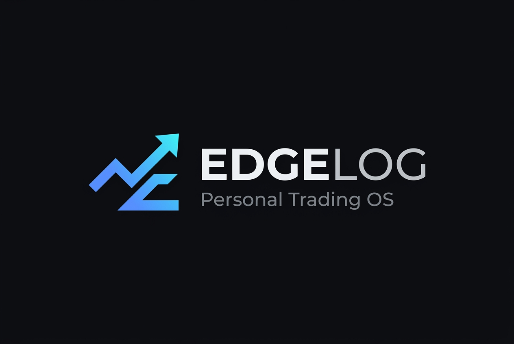

# 🚀 EDGELOG — Personal Trading Operating System

<div align="center">



**A state-of-the-art, high-performance Trading Journal & Execution Analytics Operating System built for serious discretionary and systematic traders.**

[](https://react.dev/)
[](https://www.typescriptlang.org/)
[](https://nodejs.org/)
[](https://www.mongodb.com/)
[](https://tailwindcss.com/)
[](https://vitejs.dev/)

[Features](#-key-features) • [Architecture](#-architecture) • [Getting Started](#-getting-started) • [API & Database](#-api--database) • [Data Export](#-data-storage--export-hub) • [Screenshots](#-preview)

</div>

---

## 📖 Overview

**EDGELOG** is not just a trade logger—it is a comprehensive **Trading Operating System** designed around the philosophy of **"Process Before Outcome"**. 

It empowers traders to record executions with institutional precision, enforce structured playbook rules, track psychological factors, uncover true mathematical edge through deep statistical analytics, and maintain comprehensive daily/weekly journaling.

---

## ✨ Key Features

### 📊 1. Precision Trade Logging & Database
- **Comprehensive Metrics**: Track Gross/Net PnL, R-Multiple, Risk Amount, Planned vs. Actual R:R, Fees, and Holding Duration.
- **Contextual Execution Data**: Setup tags, timeframe, trading session (Asia, London, NY), higher-timeframe bias, market condition, entry/exit models, emotions, and confidence rating (1–5).
- **Custom Columns & Formulas**: Dynamic user-defined columns with real-time formula evaluation.
- **Advanced Filtering & Saved Views**: Multi-dimensional search across setups, sessions, outcomes, and rules compliance.

### 🛡️ 2. Rule Engine & Playbook Compliance
- **Rule Tracking**: Assign custom rules (Risk Management, Entry Triggers, Trade Management).
- **Compliance Auditing**: Automatically tracks rule adherence vs. violation across all trades.
- **Post-Mortem Review**: Document reasons for rule breaks, lessons learned, and required process adjustments.

### 📈 3. Deep Performance Analytics & Edge Lab
- **Equity Curve & Drawdown Analysis**: Visual historical account growth, peak equity, and max drawdown curves.
- **Statistical Edge Discovery**: Multi-factor breakdown of Win Rate, Profit Factor, Expectancy, and Average R by Setup, Session, Timeframe, and Emotion.
- **Process vs. Outcome Matrix**: Identify lucky wins (rule broken + profit) vs. quality losses (rule followed + controlled risk).

### 📝 4. Daily & Weekly Trading Journal
- **Pre-Market Plan**: Document morning bias, key levels, and focus rules.
- **Post-Market Review**: Log execution reality, psychological takeaways, and next-day adjustments.
- **Weekly Strategy Reviews**: High-level retrospective on performance and discipline.

### 💾 5. Multi-Format File Storage & Download Hub
- 📦 **Full Database Backup (`.json`)**: One-click complete JSON backup of trades, rules, journal entries, columns, and settings.
- 📊 **Trades Spreadsheet (`.csv`)**: Clean tabular CSV export formatted for Microsoft Excel, Google Sheets, or Numbers.
- 📝 **Journal Book (`.md`)**: Full formatted Markdown book of all trading reflections and pre/post logs.
- 🚀 **1-Click Multi-Download**: Download all archives simultaneously for offline security.

### 📱 6. Responsive UI & Mobile Support
- **Glassmorphic Dark & Light Modes**: Curated design system with ultra-smooth transitions and micro-animations.
- **Mobile Optimized**: Bottom navigation dock, responsive drawer modals, and touch-friendly controls.
- **Fail-Safe Reliability**: Global React Error Boundaries ensure the app never crashes or blanks.

---

## 🏗️ Architecture

EDGELOG is built as a clean, decoupled monorepo:

```text
premium-trading-journal-system/
├── client/                     # Frontend Application
│   ├── src/
│   │   ├── components/         # Reusable UI components & dialogs
│   │   ├── pages/              # Overview, Trades, Rules, Analytics, Edge, Journal, Data
│   │   ├── lib/                # Repository API layer, analytics math, CSV parser
│   │   ├── types/              # TypeScript interfaces & domain models
│   │   ├── store.tsx           # Reactive global state management
│   │   └── App.tsx             # Root router with ErrorBoundary
│   ├── public/                 # High-res logos and icons
│   └── package.json            # Frontend scripts and dependencies
│
├── server/                     # Backend API & Cloud Engine
│   ├── src/
│   │   ├── models/             # Mongoose schemas (Trade, Rule, Journal, Settings, etc.)
│   │   ├── routes/             # REST endpoints (/trades, /rules, /journal, /export, etc.)
│   │   ├── middleware/         # Central error handling & CORS
│   │   ├── db.ts               # Resilient MongoDB Atlas connection
│   │   └── index.ts            # Express 5 server bootstrapper
│   ├── .env                    # Cloud database configuration
│   └── package.json            # Server scripts and dependencies
│
└── package.json                # Root monorepo launcher and workspace manager
```

---

## 🚀 Getting Started

### Prerequisites
- **Node.js**: v18.0.0 or higher
- **npm**: v9.0.0 or higher
- **MongoDB Atlas** (or local MongoDB instance)

### 1. Clone the Repository
```bash
git clone https://github.com/jigarsonani1012/trading-journal.git
cd trading-journal
```

### 2. Configure Backend Environment
Navigate to the `server/` directory and configure `.env`:
```env
PORT=3001
MONGODB_URI=your_mongodb_connection_string
CLIENT_ORIGIN=http://localhost:5173
```

### 3. Install All Dependencies
Install all packages across the root, client, and server workspaces in one command:
```bash
npm run install:all
```

### 4. Run the Application
Start both the Express backend and React frontend concurrently:
```bash
npm start
```
- **Frontend App**: `http://localhost:5173`
- **Backend API**: `http://localhost:3001`
- **Health Check**: `http://localhost:3001/health`

---

## 🛠️ CLI Commands

| Command | Action |
| :--- | :--- |
| `npm start` *(or `npm run dev`)* | Starts both backend API and frontend client concurrently |
| `npm run client` | Starts only the frontend Vite development server (`:5173`) |
| `npm run server` | Starts only the backend Express server (`:3001`) |
| `npm run build` | Compiles both `client` (Vite) and `server` (tsc) for production |
| `npm run build:client` | Builds only the frontend client bundle |
| `npm run build:server` | Compiles only the backend TypeScript |
| `npm run install:all` | Installs npm dependencies across all workspaces |

---

## 🔌 API & Endpoints

| Method | Endpoint | Description |
| :--- | :--- | :--- |
| `GET` | `/health` | Server uptime and health verification |
| `GET / POST` | `/api/trades` | Fetch all trades or save/update trade records |
| `GET / POST` | `/api/rules` | Fetch and update trading playbook rules |
| `GET / POST` | `/api/journal` | Load and record daily/weekly journal logs |
| `GET / POST` | `/api/settings` | Retrieve or persist user preferences |
| `GET / POST` | `/api/columns` | Manage custom dynamic table columns |
| `GET / POST` | `/api/views` | Save and recall customized filter views |
| `GET` | `/api/export/json` | Download full database dump in JSON format |
| `GET` | `/api/export/csv` | Download complete trades table in CSV format |
| `GET` | `/api/export/journal` | Download formatted markdown trading journal |
| `POST` | `/api/export/restore` | Restore database state from a backup payload |
| `GET` | `/api/export/stats` | Live database document counters & metrics |

---

## 🛡️ Security & Reliability
- **Centralized Error Boundaries**: Catches runtime view errors without crashing the application.
- **Type-Safe Validation**: Full TypeScript end-to-end typing across client state and MongoDB documents.
- **Duplicate Prevention**: Smart CSV importer checks for timestamp/symbol/price uniqueness before ingestion.
- **Environment Protection**: Sensitive keys and database URIs are excluded via `.gitignore`.

---

## 👤 Author
**Jigar Sonani**
- GitHub: [@jigarsonani1012](https://github.com/jigarsonani1012)
- Repository: [trading-journal](https://github.com/jigarsonani1012/trading-journal)

---

## 📄 License
This project is open source and available under the [MIT License](LICENSE).
